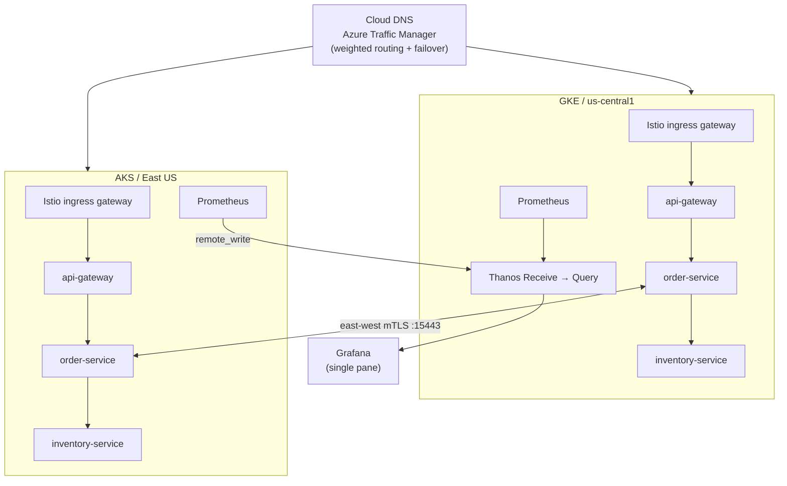

# Multi-Cloud Kubernetes Platform (GKE + AKS)

> A production-shaped platform running the same application stack on GKE and AKS, joined by an Istio multi-primary mesh, with unified observability through Thanos and Grafana and DNS-level failover through Azure Traffic Manager.


## Motivation

Cloud platforms fail. Regions go down, vendors have outages, and enterprise customers often mandate which cloud their data lives on. A platform that bets everything on one provider is one incident away from a full outage with no fallback.

I wanted to build something that treated multi-cloud not as a stretch goal but as a first-class architectural constraint — where the networking, the service mesh, the observability, and the CI/CD pipeline are all designed from the start with the assumption that workloads span two different clouds with different APIs, different IAM models, and non-overlapping network spaces. This platform is the result of that.

---

## Why It Matters

- **Vendor independence** — no single cloud provider failure takes the platform offline. Traffic Manager shifts load in minutes; the mesh reroutes within seconds once traffic is flowing.
- **Regulated workloads** — multi-cloud is often a contractual or compliance requirement, not a choice. This platform demonstrates the patterns (separate VPCs, explicit trust boundaries, no cross-cloud shared credentials) that those environments demand.
- **Cost optionality** — running identical workloads on two clouds means you can shift capacity toward whichever is cheaper at renewal time without re-architecting the application.
- **Operational realism** — the runbooks, alert rules, and failover scripts here are the kind of artefacts a platform team actually maintains, not just YAML that provisions and never gets touched again.

---

## Real-World Uses

This architecture pattern directly maps to production scenarios across several industries:

- **SaaS platforms** needing 99.99% SLAs without betting on one cloud region
- **Financial services** with cloud-specific data residency requirements per jurisdiction
- **Healthcare and government** workloads where a customer's procurement mandates a specific cloud provider per environment
- **Global applications** routing users to the geographically nearest healthy cluster
- **Disaster recovery** setups where one cloud acts as active and the other as warm standby

---

---

## Architecture



<details>
<summary>ASCII version</summary>

```text
                                   +----------------------+
                                   | Cloud DNS            |
                                   | Azure TrafficManager |
                                   +----------+-----------+
                                              |
                                     public traffic + health
                                              |
                                +-----------------------------+-----------------------------+
                                |                                                           |
                                v                                                           v
                      +---------------------+                                     +---------------------+
                      | GKE / us-central1   |                                     | AKS / East US       |
                      | network1 / cluster1 |                                     | network2 / cluster2 |
                      +----------+----------+                                     +----------+----------+
                                 |                                                           |
                        +-----------+-----------+                                   +-----------+-----------+
                        | Istio ingress gateway |                                   | Istio ingress gateway |
                        +-----------+-----------+                                   +-----------+-----------+
                                 |                                                           |
                         +-------+-------+                                           +-------+-------+
                         | api-gateway   |                                           | api-gateway   |
                         +-------+-------+                                           +-------+-------+
                                 |                                                           |
                         +-------+-------+                                           +-------+-------+
                         | order-service | <==== east-west mTLS over 15443 =====>    | order-service |
                         +-------+-------+                                           +-------+-------+
                                 |                                                           |
                         +-------+-------+                                           +-------+-------+
                         | inventory-svc |                                           | inventory-svc |
                         +---------------+                                           +---------------+

                         Prometheus                                               Prometheus
                              |                                                        |
                              |                              remote_write               |
                              +-----------------------+<-------------------------------+
                                                      |
                                               Thanos Receive
                                                      |
                                                 Thanos Query
                                                      |
                                                   Grafana
```
</details>

---

## What Works

- Terraform provisions GKE and AKS with separate cloud-specific modules
- Helm deploys the application stack to both clusters with per-cluster value overrides
- Istio runs multi-primary multi-network with east-west gateways for cross-cluster mTLS
- Cross-cluster service calls route through the mesh without manual endpoint management
- Azure Traffic Manager handles public weighted routing and health-based failover
- Grafana on GKE shows metrics from both clusters via Thanos remote_write from AKS
- GitHub Actions builds, scans, and deploys with OIDC — no static cloud keys in GitHub

---

## Why I Built It This Way

I wanted one repo that forced me to deal with tradeoffs instead of hiding them. GKE and AKS do not look the same once you get past the cluster marketing page, so I kept them in separate Terraform modules rather than abstracting them into a generic interface that would smooth over the differences.

The mesh is multi-network because pod IPs stop being meaningful the second traffic crosses clouds. Monitoring is push-based from AKS to GKE because that plays nicer with NAT and public edges than a pull-only setup.

Failover is intentionally layered. Public traffic moves at DNS, which is slower but simple and requires no mesh awareness. Inside the mesh, outlier detection reacts faster once requests are already moving. Keeping those two mechanisms separate made the whole platform easier to reason about and debug independently.

---

## Stack

| Area | Version / shape | Notes |
|---|---|---|
| Terraform | 1.14.8 | Root module with separate `gke/`, `aks/`, and `dns/` modules |
| GCP provider | `hashicorp/google` 7.25.0 | GKE, VPC, firewall, Cloud DNS |
| Azure provider | `hashicorp/azurerm` 4.66.0 | AKS, VNet, NSG, Traffic Manager |
| Kubernetes | GKE Regular channel, AKS current GA | |
| Istio | 1.29.1 | Multi-primary, multi-network with east-west gateways |
| Helm | 4.1.3 | App chart, monitoring installs, external-dns |
| Go | 1.22.x | `api-gateway` and `order-service` |
| Python | 3.12.x / Flask 3.1.x | `inventory-service` |
| Monitoring | kube-prometheus-stack 82.10.3 · Thanos Receive + Query · Grafana 10.7.0 | One Grafana view over both clusters |
| CI | GitHub Actions + OIDC | No static cloud credentials in GitHub |

---

## Quick Start

1. Copy `terraform/terraform.tfvars.example` to `terraform/terraform.tfvars` and fill in cloud, registry, and DNS values.
2. `make init TF_BACKEND_BUCKET=<bucket> TF_BACKEND_PREFIX=multi-cloud-k8s/dev`
3. `make plan-gke && make plan-aks`
4. `make apply-all`
5. Build and push images, then deploy the Helm chart to both clusters.
6. `./mesh/scripts/setup-mesh.sh --gke-context <ctx> --aks-context <ctx>`
7. `./monitoring/scripts/install-monitoring.sh --gke-context <ctx> --aks-context <ctx>`
8. `./routing/scripts/dns-verify.sh && ./routing/scripts/test-failover.sh && ./scripts/quick-test.sh`

---

## Repository Layout

```text
.
├── terraform/          # Cloud infra — separate gke/, aks/, dns/ modules
├── app/                # Three services (api-gateway Go, order-service Go, inventory-service Python)
│   └── docker-compose.yml
├── helm/               # Umbrella chart with per-cluster value overrides
├── mesh/               # Istio multi-cluster setup, east-west gateways, traffic policy
├── monitoring/         # Prometheus, Thanos, Grafana, alerts
├── routing/            # external-dns, Traffic Manager Terraform, failover scripts
├── tests/              # Smoke, integration, load, OPA policy checks
├── docs/               # Architecture docs, ADRs, runbooks
├── costs/              # Cost estimate and optimization notes
├── Makefile            # All workflow targets
└── Justfile            # Alternative task runner
```

---

## Costs

The always-on lab shape runs around **$675/month** — on-demand node pools, public edges, central monitoring, both clusters up continuously. Most of the bill is node compute. Detail in [`costs/estimate.md`](costs/estimate.md).

---

## Known Gaps

- Tracing headers are propagated but no span store is wired up — Jaeger or Tempo would be the next addition.
- Grafana dashboard JSON has some rough panel layout that I'd clean up if I kept this running longer.
- No night-time scale-down — the platform stays always-on right now, which trades cost for simplicity.

---

## What I Learned

- **Multi-network Istio is not the same as multi-cluster Istio.** When pod CIDRs overlap across clouds you cannot use flat networking. The east-west gateway pattern — where each cluster exposes services on a dedicated gateway and the mesh routes to remote endpoints by hostname — is the only option, and debugging it when it breaks requires reading Envoy xDS state directly with `istioctl proxy-config`.
- **GKE and AKS Terraform modules cannot share an abstraction cleanly.** Firewall rules, node pool shapes, workload identity setup, and managed add-on APIs are different enough that a shared module would have been a leaky abstraction. Separate modules with explicit outputs were more honest.
- **OIDC for GitHub Actions is non-trivial on AKS.** GCP has first-class Workload Identity Federation support in the provider. Azure requires a federated credential on an App Registration, RBAC assignment on the subscription, and the `azure/login` action wired correctly. Getting both working in the same pipeline without static keys took a few iterations.
- **Push-based remote_write from AKS to GKE is more reliable than federation across clouds.** Prometheus federation pulls — if NAT or public IPs shift, scrapes fail silently. With Thanos Receive, the AKS cluster pushes metrics over a stable public endpoint and the failure mode is visible immediately in Thanos Query.
- **Layering failover at DNS and mesh separately is the right call.** DNS failover is slow (TTL-bound) but requires zero mesh awareness — it works even if Istio is broken. Mesh-level outlier detection is fast but only kicks in once traffic is already flowing. Keeping them independent meant I could test and reason about each layer without the other interfering.
